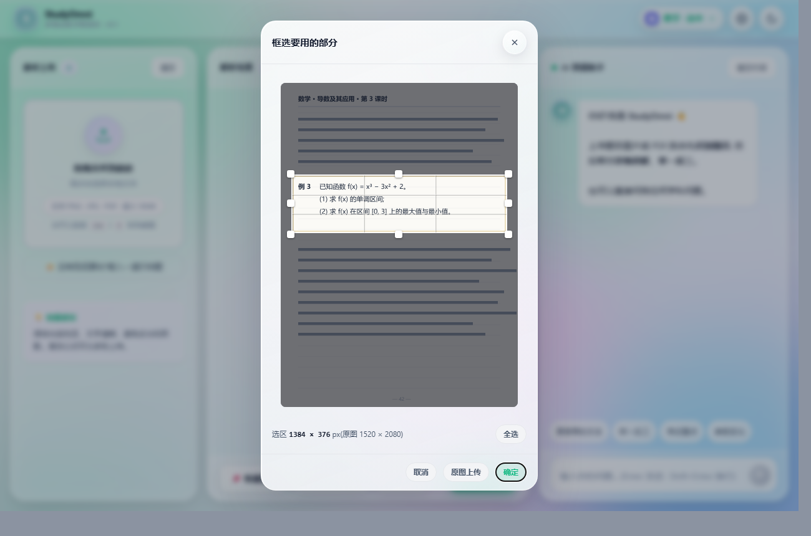
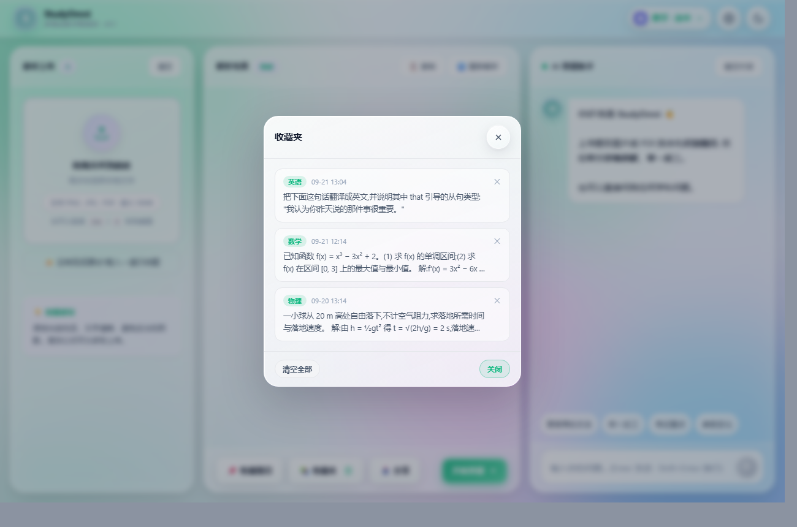
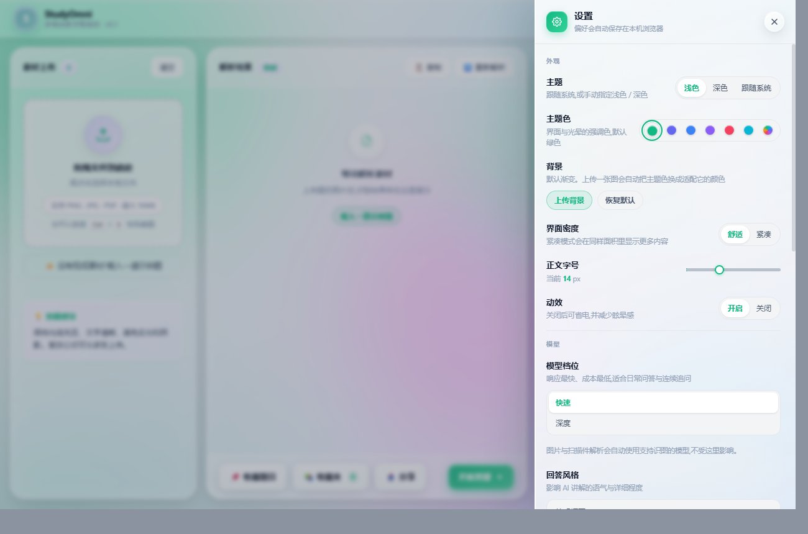
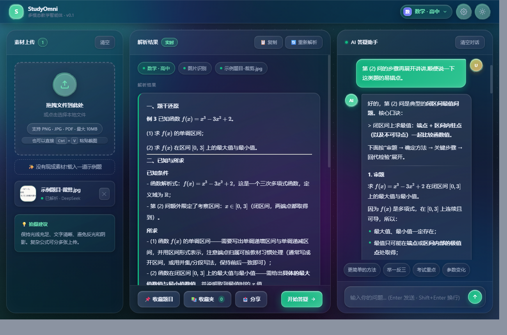
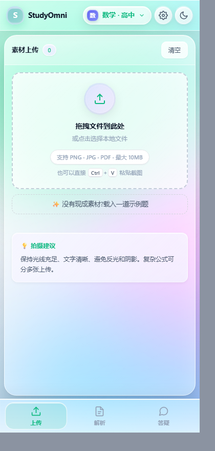

# StudyOmni

多模态教学智能体 · 粤港澳大湾区 AI Coding 创新大赛参赛项目。

前端为纯静态资源(无构建),后端用 Cloudflare Pages Functions 做代理层
—— 模型密钥只存在云端 Secret 里,浏览器与前端代码都不持有。


左栏上传素材 → 中栏给出结构化解析 → 右栏接着追问。整条链路都是真实调用,
截图里的解析结果与回答均来自模型实际输出。

**在线体验**:<https://studyomni.pages.dev>

## 目录结构

```
public/              静态资源,即 wrangler.toml 里的 pages_build_output_dir
  index.html         全部前端(HTML + CSS + JS 单文件,无构建)
functions/           Cloudflare Functions(必须在项目根,不能放进 public)
  api/chat.js        POST /api/chat  流式对话
  api/parse.js       POST /api/parse 图片 / 多页 / 文本解析
  _lib/              共享模块(下划线开头,不映射成路由)
    providers.js     模型接入(DeepSeek 单家)+ 档位表 + token 预算 + 防 SSRF 端点
    prompts.js       学科提示词生成器(61 门学科,三层组合)
    ratelimit.js     限流 + 同源校验
tests/               离线测试,`npm test` 全跑
  theme.test.mjs     配色算法 + 玻璃通透度 + 弹窗层叠结构
  crop.test.mjs      裁剪的坐标映射 + 结构防回归
  providers.test.mjs 厂商表自洽性 + 模型名解析 + 防 SSRF 源码断言
  ratelimit.test.mjs 限流与同源校验
  subjects.test.mjs  学科表一致性 + 提示词生成
docs/                README 用图
```

测试是**纯离线**的:配色算法与坐标映射都写成了不碰 DOM 的纯函数,
直接抠出来在 Node 里跑;其余靠在源码上做结构断言(比如"弹窗必须在 .app 外面")。
`npm test` 当前 **382 项**。

### 源码导航

`public/index.html` 近 8000 行,所以文件里带一份**生成出来的目录**(放在 `<head>`),
列出 4 段共 54 个区块的行号,打开文件就能跳。

```bash
npm run toc     # 改了分节横幅之后重新生成
```

`npm test` 的第一件事就是校验这份目录与正文一致,并逐个核验行号是否真的指向
一条横幅 —— 不一致直接失败。**手写目录一定会过期**,别再改回手写。

## 素材解析:三条路

| 输入 | 处理方式 | 说明 |
|---|---|---|
| 图片 | 压缩后交给视觉模型 | 手机拍的照片,先压到最长边 1600 再传 |
| PDF(有文本层)| pdf.js 抽文本 → 纯文本通道 | 便宜、快,一次能读 20 页 |
| PDF(扫描件)| pdf.js 渲染页面成图 → 视觉模型 | **整页是图片、没有文本层**,默认渲染前 3 页 |

扫描件的判定标准是**每页平均字数 < 30**:低于这个值基本能断定没有可用的文本层
(真实扫描件的文本量通常是 0,只有页码水印)。渲染时用 2 倍缩放保证小字清晰,
超过 1600px 再缩回去。

> 这是演示最容易翻车的地方 —— 真实的卷子、课本扫描件极多,
> 早期版本遇到直接放弃,现在会渲染成图交给视觉模型。

### 上传前先框选(裁剪)

选好图片后会弹出裁剪窗口,拖拽框出真正要识别的部分 —— 一页课本里往往只有
一道题是要问的,整页丢给模型既贵又容易被无关内容带偏。裁剪走 canvas 出图,
非图片(如 PDF)自动跳过。



- 框内拖动 = 移动,八个手柄 = 缩放,「全选」一键框住整张
- 实时显示**源图像素**尺寸,不是屏幕像素
- 三个出口:**取消** / **原图上传**(干净截图不必裁)/ **确定**
- 不想每次都弹,设置里可以关掉「上传图片时先裁剪」

### 没有现成素材?载入示例题

现场演示经常遇到"演示机上没有题目图片"。点一下「载入一道示例题」会**用 canvas
现画**一张整页习题(含页眉、正文、例题、页码),然后走完整链路:
框选 → 识别 → 答疑。刻意画成整页而不是只有题干,顺便把裁剪那一步也演示出来。

> 之所以现画而不是塞一张图进仓库:项目的约束是零依赖单文件,
> 不能为了演示多一个静态资源。

### 收藏夹

解析结果可以收藏,收藏夹里能查看、点开载回中栏、单条删除或清空。
数据存在 localStorage(最多 50 条),不上传服务端。



## 学科

61 门学科,分 6 组:小学 / 初中 / 高中 / **编程 · 计算机** / 大学 / 通识 · 素养。

学科不是 61 份独立模板,而是三层组合(见 `functions/_lib/prompts.js`):

```
① 学段语气(小学 / 初中 / 高中 / 大学 / 进阶 / 通识)
    ×
② 学科策略(15 种:math · code · web · db · system · medical · …)
    ×
③ 学科具体重点
```

**编程方向刻意做厚**:Python、C/C++、Java、JavaScript、Go、Rust、C# 七种语言,
外加前端 / 后端 / 数据库 / 算法与数据结构 / 算法竞赛 / 操作系统 /
计算机网络 / 计算机组成原理 / 编译原理 / 软件工程 / 网络安全。

新增学科 = `SUBJECTS` 里加一行 + 前端下拉加一项。**两边必须同时改** ——
漏了不会报错(会静默降级成通用策略,学科特色就丢了),所以
`tests/subjects.test.mjs` 专门守这条线:双向一一对应、策略与语气都存在、
每个 prompt 都带本学科重点。`npm test` 会一起跑。

## 界面

三栏 = 上传 / 解析 / 答疑。材质是自绘的「液态玻璃」:半透明底 + 背景模糊 +
顶部内高光与折射边,不引任何 UI 框架。

 

- **八套配色**:六套内置主题色 + 一个「更多」自定义取色器(任意色相都能推出一整套
  强调色变量)。也可以上传一张背景图,自动提取主色并把主题色换过去。
- **暗色模式**与跟随系统;字号缩放、界面密度、动效开关、三栏宽度都可调。
- 浮层永远比面板更实(抽屉 / 弹窗 > 卡片 > 胶囊 > 面板)—— 玻璃可以透,
  但正文必须读得清。

## 移动端



**窄屏(≤860px,或竖屏 ≤1024px)下三栏改成「一次一栏」**,用底部的液态玻璃
导航条(上传 / 解析 / 答疑)切换。早期做法是把三栏纵向堆成一个 1000px 高的长页面,
手机上要不停下滑,而且面板被压扁、输入框被顶出屏幕。

宽度更宽时导航条 `display: none`,恢复三栏并排,布局与以前完全一致。
上传/解析完成会在对应标签上点未读小红点,上传数量显示为角标。

几个关键点(都是实测踩出来的):

- **用 `100dvh` 而不是 `100vh`**。手机上 `100vh` 含地址栏高度,页面会比可视区高,
  底部被裁掉 → 用户表现为"要缩小才看得全"。写法是
  `height: 100vh; height: 100dvh;` 两级兜底。
- **`.app` 的网格列必须是 `minmax(0, 1fr)`**。默认 `auto` 轨道的下限是子项的
  min-content,而顶栏的 min-content 约 **382px**(logo + 标题 + 学科胶囊 + 两个图标按钮),
  会把整页撑到 382px —— 于是 360/375px 的手机上**必然横向溢出**。
  这是最隐蔽的一处,也是"页面显示不完整"的主因。
- **输入框字号 ≥ 16px**。iOS Safari 在小于 16px 时聚焦会自动放大整页。
- `viewport-fit=cover` + `env(safe-area-inset-*)`,让玻璃铺到刘海与底部横条底下。
- 顶栏在窄屏要允许收缩:副标题(≤430px 隐藏)、学科胶囊封顶 `46vw` 并省略号截断。

> 测窄屏请用 iframe 控制视口,别用 `--window-size`。Chromium 在 Windows 上对
> 窗口宽度有下限(请求 390 实际拿到 492),直接测会得出错误结论。

## 粘贴上传

截图工具、微信、文件管理器里复制之后,直接 **Ctrl+V** 就能把图片或 PDF 加进素材区
(document 级 paste 监听)。几个细节:

- 纯文本粘贴**不拦截** —— 那是用户想往输入框里粘字,放行给浏览器默认行为。
- 粘贴来的文件常常没有有意义的名字(`image.png`),自动补成 `粘贴-HHMMSS.png`。
- 只收图片与 PDF,其他类型提示后跳过。
- 触屏设备上「Ctrl+V」提示自动隐藏(没有 Ctrl 键,留着只会让人困惑)。

## 本地开发

```bash
cp .dev.vars.example .dev.vars    # 填入你的密钥
npm install
npm run dev                        # 等价于 wrangler pages dev public
```

打开 http://localhost:8788 。Functions 与静态资源同源,不需要配跨域。

## 部署

推荐 Git 集成(Cloudflare 会自动处理 `functions/` 目录):

- Build command:留空
- Build output directory:`public`
- Framework preset:None

然后在 **Settings → Environment variables** 里加:

| 变量 | 值 | 是否加密 |
|---|---|---|
| `DEEPSEEK_API_KEY` | `sk-...` | **是** |

只需要这一个密钥。模型名有默认值,想改见「模型档位与模型名」一节。

命令行部署:

```bash
npx wrangler login
npx wrangler pages secret put DEEPSEEK_API_KEY
npm run deploy
```

## 限流与防刷

公网可访问之后,`/api/chat` 与 `/api/parse` 谁都能打 —— 所以每个请求
进入业务逻辑之前会先过两道闸(都在 `functions/_lib/ratelimit.js`):

1. **同源校验** —— 请求头里的 `Origin` 必须等于自身域名。
   别家网站把接口嵌进自己页面调用会被挡掉。curl / 脚本不带 `Origin`,
   一律放行(它们本来就是合法调用方)。
2. **两级限流** —— 单 IP 每分钟 20 次 + 全站每天 2000 次。
   被拦的请求**不计入用量**(否则刷子光靠被拒就能把日额度耗光),
   响应带 `Retry-After`,前端可据此退避。

三个环境变量可按需覆盖:`RATE_LIMIT_PER_MIN` / `RATE_LIMIT_PER_DAY` /
`ALLOWED_ORIGINS`(见 `.dev.vars.example`)。

> **计数是存在 isolate 内存里的** —— 冷启动清零、多实例不共享,属于
> 「降低伤害」而不是「硬性防御」。这是刻意取舍:精确计数要用 KV 或
> Durable Objects,而 KV 免费额度每天只有上千次**写**,拿它给每个请求
> 计数会先把自己的额度写爆。
>
> 要硬防就在 Cloudflare 控制台配**速率限制规则**(在边缘拦掉,
> 请求进不到 Worker,不产生任何 token 费用)。是否可用取决于套餐,
> 以控制台实际显示为准。

## 模型档位与模型名

**只接 DeepSeek 一家。** 理由很直接:它是境内直连、无需额外网络条件的一条路,
也是唯一端到端实测过的(流式 / 视觉 / 扫描件)。

早先版本放过 `gemini` 与 `openai`(境内连不上,是死配置),
后来换成四家国产厂商 —— 但没有可用密钥做端到端验证,一次都没被调用过,
同样属于"摆着好看"。演示要的是**真能跑通**的一条路,所以收敛成一家。

界面上只暴露两个档位,各自对应一个真实存在的模型:

| 档位 | 模型 | 说明 |
|---|---|---|
| **快速**(默认) | `deepseek-flash` | 响应最快、成本最低,适合日常问答与连续追问 |
| **深度** | `deepseek-v4-pro` | 推理更强,适合数学推导与多步讲解;**实测明显更慢** |

默认选「快速」不是随手定的:实测 `deepseek-v4-pro` 回答一个"3²+4²"
要 **16.7 秒**、思维链烧掉 1024 tokens;`deepseek-flash` 同样会输出思维链
(实测 40~60 tokens),但 1 秒内就有正文。交互式答疑里前者当默认太慢。

**图片与扫描件解析固定走 `deepseek-flash`,与用户选的档位无关** ——
实测把图片喂给 `deepseek-v4-pro` 会一路空转到 `finish_reason=length`、
正文一个字都不出。所以识图由输入类型决定,不让用户选。

### 官方只支持两个模型名

实测 `GET https://api.deepseek.com/models` 只返回:

```
deepseek-flash
deepseek-v4-pro
```

> ⚠️ 别用 `deepseek-v4-flash`。它能跑通(服务端接受),但**不在官方支持列表里**
> —— 报错信息原文是 "The supported API model names are deepseek-flash,
> deepseek-v4-pro"。属于未公开别名,随时可能消失。
> 同理 `deepseek-chat` / `deepseek-reasoner` 已于 2026-07-24 退役。

### 改名时改配置,不用改代码

```bash
DEEPSEEK_MODEL_FAST=deepseek-flash     # 「快速」档
DEEPSEEK_MODEL_DEEP=deepseek-v4-pro    # 「深度」档
DEEPSEEK_VISION_MODEL=deepseek-flash   # 图片 / 扫描件解析
```

不填就用 `functions/_lib/providers.js` 里的默认值。

`GET /api/chat` 会返回一份自检,列出**每个档位当前生效的模型名、被哪个环境变量
覆盖、密钥是否已配**(只报状态,绝不回传密钥本身),排查时先看它:

```bash
curl -s https://<你的域名>/api/chat
```

### 想再接一家?

照 `functions/_lib/providers.js` 顶部的说明改三处即可(endpoint 常量、
密钥环境变量、档位表里的模型 id),业务层不用动。

**端点必须写死在该文件里,不能由前端指定** —— 否则就是一个 SSRF 入口。
`tests/providers.test.mjs` 会直接读源码来守这条线:API 层不允许从 `env`
或请求体里取端点,不允许绕过 `callUpstream` 自己直连外部地址,
也不允许直接采纳客户端送来的模型名(前端只送 `tier` 这种抽象档位)。

## token 预算与「回答空白」的排查

DeepSeek V4 这类模型会先输出一段思维链(`reasoning_content`),它和正文
**共用** `max_tokens`。所以服务端在转发前会过一层 `resolveMaxTokens()`:
把你设置的「最大回答长度」当作正文额度,额外再加 6144 的思考预算,
再夹到上游硬限 **8192**。

前端会把 `finish_reason` 和思维链一并读出来,三种情况给不同提示:

| 情况 | 表现 | 提示 |
|---|---|---|
| 预算被思考吃光 | 正文为空 | 明说被截断,附思考摘要,建议调大长度或拆小问题 |
| 有正文但被截断 | 内容可读 | 气泡尾部加一行截断提示 |
| 真没返回 | 完全空白 | 通用排查指引 |

想更快:① 把问题拆小 ② 到设置里把回答风格改成「简洁」
(实测同一题 20.8s → 8.9s) ③ 换非推理模型。

## 公式渲染

页面里的 `$...$` / `$$...$$` / `\(...\)` / `\[...\]` 会交给 [KaTeX](https://katex.org) 排版,
**按需加载** —— 只有渲染到公式时才去 CDN 取(jsdelivr),平时零请求。

加载前的兜底是一套自带的 LaTeX → 可读文本转换(`latexPlain`),
离线 / 内网 / CDN 拉不到时显示的是 `ln(x²-ax+1)` 而不是源码。
设置里的「公式使用 LaTeX 渲染」开关可以随时退回纯文本。

## 调试接口

```bash
curl https://你的域名/api/chat
```

```jsonc
{
  "ok": true,
  "provider": "DeepSeek",
  "keyEnv": "DEEPSEEK_API_KEY",
  "keyConfigured": true,
  "defaultTier": "fast",
  "tiers": [                     // 每个档位当前生效的模型名
    { "name": "fast", "label": "快速", "model": "deepseek-flash",
      "desc": "响应最快、成本最低,适合日常问答与连续追问", "overriddenBy": null },
    { "name": "deep", "label": "深度", "model": "deepseek-v4-pro",
      "desc": "推理更强,适合数学推导与多步讲解;实测明显更慢", "overriddenBy": null }
  ],
  "visionModel": "deepseek-flash",   // 图片 / 扫描件解析固定用它
  "visionOverriddenBy": null,
  "limits": {                    // 当前生效的限流参数与用量
    "perMinutePerIP": 20,
    "perDayGlobal": 2000,
    "usedToday": 0,
    "inFlightKeys": 0
  },
  "usage": "用 POST 发起对话"
}
```

前端启动时会探测这个接口:拿不到 `ok + keyConfigured` 就自动降级到本地演示模式。

## 无后端时的行为

直接双击打开 `public/index.html`(未部署 Functions)时,页面会自动降级到
本地演示模式,不会白屏 —— 方便离线演示与 UI 调试。
